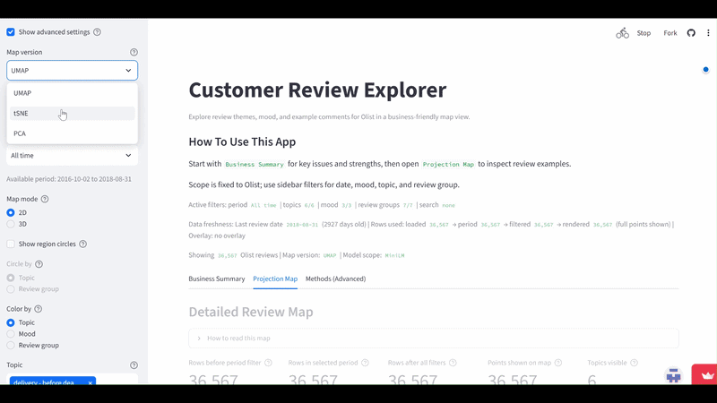

# E-commerce Reviews – What frustrates customers most?

I read 36,567 e-commerce reviews so nobody else has to. The result is an interactive map of where customers get frustrated, and what to fix first.



**[Try it live →](https://interactive-customer-review-map.streamlit.app/)** · [Full report (PDF)](report/olist_negative_sentiment_geometry_report.pdf) · [Analysis notebook](notebook/olist_negative_sentiment_geometry_analysis.ipynb)

## Context

Unstructured feedback is where the real customer voice lives, but no CX team has time to read 36,000 reviews. This project embeds every review from the Olist Brazilian e-commerce dataset, projects them onto a 2-D map, clusters them into themes, and wraps the result in a Streamlit app where a non-technical user can see the complaint hotspots, click into example reviews, and decide what to fix first.

The research question underneath: **does negative sentiment form dense pockets in embedding space (a few concrete problems) or spread diffusely across topics (general unhappiness)?** The answer decides whether "fix the top two issues" is a realistic strategy.

## Data

- Olist `order_reviews` (Kaggle): 98,410 reviews, Portuguese; 36,567 with usable text after cleaning and filtering.
- 1–2 stars = negative (28.9% of the corpus), 4–5 = positive, 3 = neutral.
- English snippets in the app come from a linked translated file, not live translation.

## Results

- **86% of negative reviews sit in just two clusters.** Cluster "não recebi o produto" (21% of all reviews, 75% negative) is *non-delivery*; cluster "produto veio…" (17% of reviews, 52% negative) is *wrong or damaged item*. Everything else is mostly praise.
- **The problem is logistics, not product quality.** The "product quality / recommend" clusters are 1.5–6% negative. If a CX team fixes delivery reliability and order accuracy, most of the negative volume goes with it.
- **The signal is "islands" under two of three embedding models.** BERTimbau and OpenCLIP-text both isolate a dense negative island; multilingual MiniLM spreads it more diffusely. Negative homophily (share of a review's 20 nearest neighbours with the same sentiment) is 0.60–0.73 versus a 0.29 base rate, so negativity clusters strongly under every model.
- 7 clusters (k chosen by silhouette + stability across 4 seeds); sentiment purity 0.67–0.79.

## Features (the app)

- **Business Summary** — KPIs, topic and mood distributions, monthly trend, word clouds.
- **Projection Map** — every dot is a review; colour by mood, topic or cluster; switch UMAP / t-SNE / PCA and 2-D / 3-D; filter by date, topic, mood or free-text query.
- **Review Deepdive** — click, lasso or box-select dots to read the reviews, see their metadata and explore nearest neighbours.
- **Methods** — projection and clustering diagnostics for the technical reader.

## Approach

1. Clean and filter text (`src/preprocessing.py`), keep reviews with ≥ 90% retention target.
2. Embed with three models under one pipeline: BERTimbau (Portuguese), multilingual MiniLM, OpenCLIP text encoder (`src/embeddings.py`).
3. Project with PCA / UMAP / t-SNE (`src/projection.py`); cluster with K-means (k-grid 2–12) and DBSCAN (`src/clustering.py`).
4. Evaluate with negative-ratio dispersion, kNN homophily, island detection and bootstrap CIs (`src/evaluation.py`).
5. Serve the projection tables to a lightweight Streamlit app (`interactive-map-lite/`).

## Stack

Python · pandas · sentence-transformers · UMAP · scikit-learn · Plotly · Streamlit

## Run it

```bash
pip install -r requirements.txt

# app (reads shipped projection caches, no GPU needed)
pip install -r interactive-map-lite/requirements.txt
streamlit run interactive-map-lite/app.py

# reproduce the analysis
python scripts/run_submission_pipeline.py --validate-only     # check package completeness
python scripts/run_submission_pipeline.py --skip-report-pack  # rebuild projections from caches
python scripts/run_submission_pipeline.py                     # full pipeline (embeddings are slow on CPU)

# notebook — set PHASE3_RECOMPUTE = False and RUN_HEAVY_3D = False for a quick rerun
jupyter notebook notebook/olist_negative_sentiment_geometry_analysis.ipynb

# report
cd report && latexmk -pdf olist_negative_sentiment_geometry_report.tex
```

## Structure

```
interactive-customer-review-map/
├── interactive-map-lite/     # Streamlit app (app.py, requirements.txt)
├── src/                      # data, preprocessing, embeddings, projection, clustering, evaluation
├── scripts/                  # run_submission_pipeline.py and helpers
├── notebook/                 # main analysis notebook
├── report/                   # LaTeX source, compiled PDF, figures
├── data/                     # source reviews + processed / projection caches
├── artifacts/                # cached evaluation tables (cluster sizes, topic table, CIs)
└── assets/                   # README media
```

Course project for *NLP & Semantic Analysis*.
